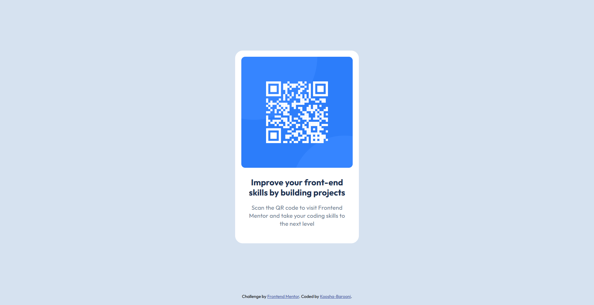

# Frontend Mentor - QR code component solution

This is a solution to the [QR code component challenge on Frontend Mentor](https://www.frontendmentor.io/challenges/qr-code-component-iux_sIO_H). Frontend Mentor challenges help you improve your coding skills by building realistic projects.

## Table of contents

- [Overview](#overview)
    - [Screenshot](#screenshot)
    - [Links](#links)
- [My process](#my-process)
    - [Built with](#built-with)
    - [What I learned](#what-i-learned)
    - [Useful resources](#useful-resources)
- [Author](#author)

## Overview

### Screenshot



### Links

- Solution URL: [my Solution](https://www.frontendmentor.io/solutions/qr-code-component-lyd7RuInvC)
- Live Site URL: [Live Site](https://qr-code-component-koosha.netlify.app/)

## My process

### Built with

- Semantic HTML5 markup
- Flexbox
- CSS Grid
- Responsive design techniques

### What I learned

I learned how to use responsive techniques like:

1- How to use the rem unit:

```css
html {
    font-size: 62.5%;
}
```

2- Using iterable classes

```HTML
<h2 class="qr-card--heading center">Improve your front-end skills by building projects</h2>

```

```css
.center {
    text-align: center;
}
```

2- what is the Dynamic viewport units?

```css
body {
    height: 100dvh;
}
```

### Useful resources

- [The large, small, and dynamic viewport units](https://web.dev/blog/viewport-units)- This is an amazing article which helped me finally understand Dynamic viewport units. I'd recommend it to anyone still learning this concept.

## Author

- Frontend Mentor - [@koosha-barooni](https://www.frontendmentor.io/solutions/qr-code-component-lyd7RuInvC)
