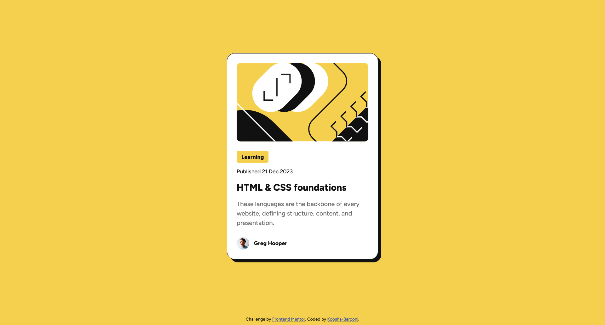

# Frontend Mentor - Blog preview card solution

This is a solution to the [Blog preview card challenge on Frontend Mentor](https://www.frontendmentor.io/challenges/blog-preview-card-ckPaj01IcS). Frontend Mentor challenges help you improve your coding skills by building realistic projects.

## Table of contents

- [Overview](#overview)
    - [The challenge](#the-challenge)
    - [Screenshot](#screenshot)
    - [Links](#links)
- [My process](#my-process)
    - [Built with](#built-with)
    - [What I learned](#what-i-learned)
    - [Continued development](#continued-development)
    - [Useful resources](#useful-resources)
    - [AI Collaboration](#ai-collaboration)
- [Author](#author)
- [Acknowledgments](#acknowledgments)

## Overview

### The challenge

Users should be able to:

- See hover and focus states for all interactive elements on the page

### Screenshot



### Links

- Solution URL: [my Solution](https://www.frontendmentor.io/solutions/blog-preview-card-4vxkbZUSAu)
- Live Site URL: [Live Site](https://blog-preview-card-koosha.netlify.app/)

## My process

### Built with

- Semantic HTML5 markup
- Flexbox
- CSS Grid
- Responsive design techniques and media queries
- clamp() function for responsive font-size

### What I learned

Things I learned from this project:

1-I understand what **clamp()** is and how I can use it to adjust responsive font size.

2- a technique that how to center a card on a page:

```
 body {
display: grid;
    grid-template-rows: 1fr auto;
    place-items: center;
}
```

3- how to add a downloaded or custom font to a css file:

```
@font-face {
    font-family: "Figtree";
    src: url("../assets/fonts/static/Figtree-Medium.ttf") format("truetype");
    font-weight: 500;
}
@font-face {
    font-family: "Figtree";
    src: url("../assets/fonts/static/Figtree-ExtraBold.ttf") format("truetype");
    font-weight: 800;
}
```

4- how to use link, visited, hover and active pseudo classes:

```
.attribution a:link,
.attribution a :visited{
    color: #3e52a3;
    text-decoration: underline dotted;
    text-underline-offset: 2px;
}
.attribution a:hover,
.attribution a :active {
    color: #111;
}
```

5 - how to customize links underline:

```
text-decoration: underline dotted;
text-underline-offset: 2px
```

6- How to use media queries

### Continued development

i want my focus on clean coding ability ,use custom css class and learning more about media queries and especially `clamp()` function

### Useful resources

- [CSS Units: When and How to Use Them](https://dev.to/tomasdevs/css-units-when-and-how-to-use-them-3nj7)- This was a great article that helped me finally understand Dynamic and static viewport units and also how to use them in different situation . I recommend reading it to anyone who is still learning the concept or have a question about them.

- [Can i use](https://caniuse.com/)- I use this site to check properties that I am not sure are compatible with major browsers, I recommend that you definitely use this site.

### AI Collaboration

I used Gemini with "AGENTS.md" to check if my property syntax is correct for the floating part, and it explained the clamp() function further and guided me how to get the value of vm and the values ​​of the fixed and variable parts of the function.

## Author

- Frontend Mentor - [@koosha-barooni](https://www.frontendmentor.io/profile/koosha-barooni)

## Acknowledgments

I would like to thanks [Abdelrhman Abdelaal](https://www.frontendmentor.io/profile/MrBlackvanta) for learned me how to center a single card in a page
