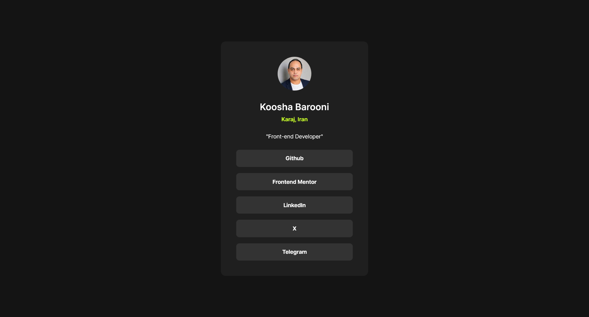

# Frontend Mentor - Social links profile solution

This is a solution to the [Social links profile challenge on Frontend Mentor](https://www.frontendmentor.io/challenges/social-links-profile-UG32l9m6dQ). Frontend Mentor challenges help you improve your coding skills by building realistic projects.

## Table of contents

- [Overview](#overview)
    - [The challenge](#the-challenge)
    - [Screenshot](#screenshot)
    - [Links](#links)
- [My process](#my-process)
    - [Built with](#built-with)
    - [What I learned](#what-i-learned)
    - [Continued development](#continued-development)
    - [AI Collaboration](#ai-collaboration)
- [Author](#author)

## Overview

### The challenge

Users should be able to:

- See hover and focus states for all interactive elements on the page

### Screenshot




### Links

- Solution URL: [My solution](https://www.frontendmentor.io/solutions/social-links-profile-dEkfmeT6YC)
- Live Site URL: [Live site](https://social-links-profile-koosha.netlify.app/)

## My process

### Built with

- Mobile-first workflow
- Semantic HTML5 markup
- CSS custom properties
- Flexbox
- CSS Grid

### What I learned

Things I learned from this project:

1- Mobile-first workflow

2- How to use `:focus` pseudo class

```
.social-card--link:focus {
    outline: none;
    box-shadow: 0 0 10px 1px #c4f82a;
}
```

### Continued development

I want to learn how to use CSS preprocessors and improve my mobile-first workflow skills.

### AI Collaboration

I used Gemini with the `AGENTS.md` file to review my mobile-first workflow.

## Author

[my social links](https://social-links-profile-koosha.netlify.app/)
