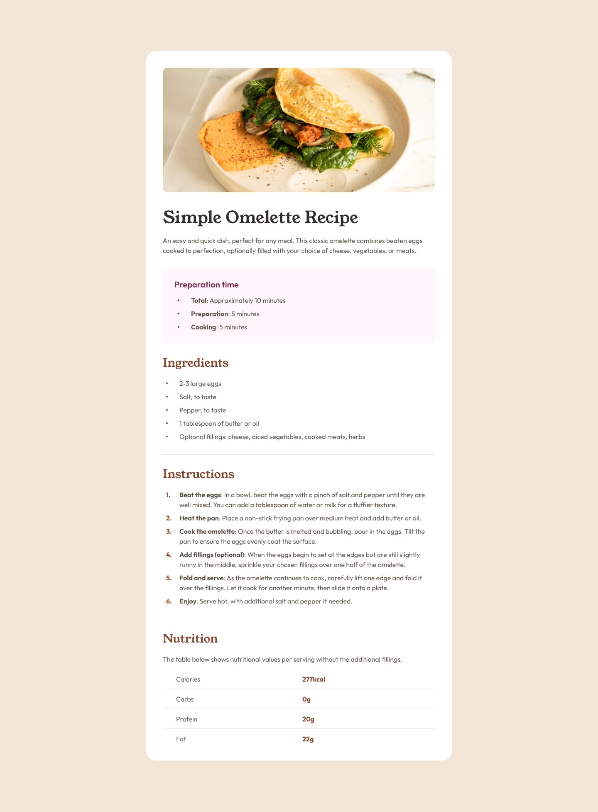
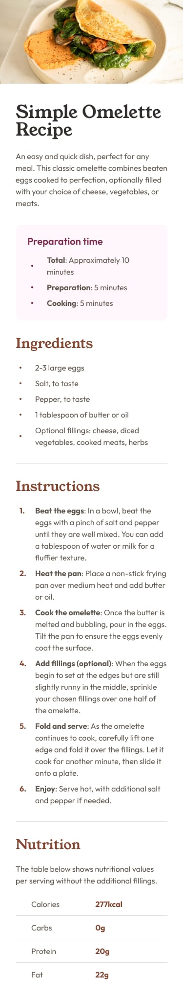
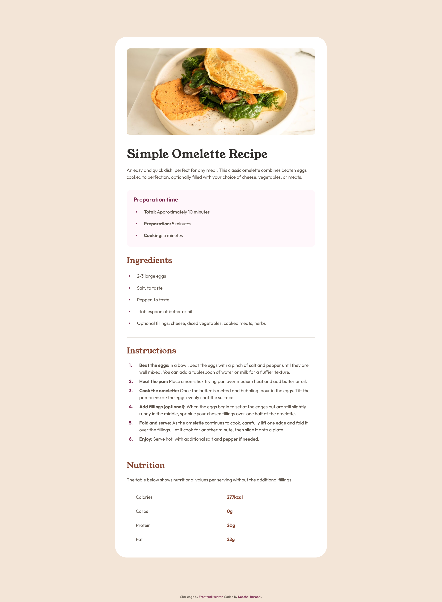
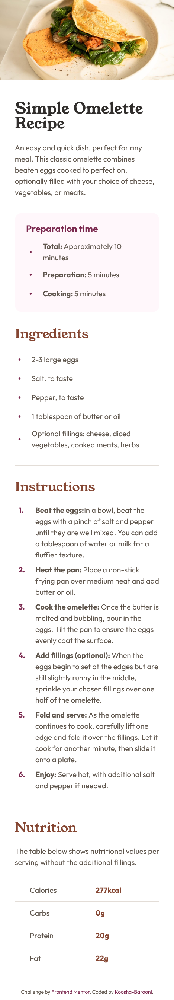

# Frontend Mentor - Recipe page solution

This is a solution to the [Recipe page challenge on Frontend Mentor](https://www.frontendmentor.io/challenges/recipe-page-KiTsR8QQKm). Frontend Mentor challenges help you improve your coding skills by building realistic projects.

## Table of contents

- [Overview](#overview)
    - [The challenge](#the-challenge)
    - [Screenshot](#screenshot)
    - [Links](#links)
- [My process](#my-process)
    - [Built with](#built-with)
    - [What I learned](#what-i-learned)
    - [Continued development](#continued-development)
    - [Useful resources](#useful-resources)
    - [AI Collaboration](#ai-collaboration)
- [Author](#author)

## Overview

### The challenge

Your challenge is to build out this recipe page and get it looking as close to the design as possible.

You can use any tools you like to help you complete the challenge. So if you've got something you'd like to practice, feel free to give it a go.

### Screenshot

#### Original Design





<hr>

#### My solution





### Links

- Solution URL: [Add solution URL here](https://your-solution-url.com)
- Live Site URL: [Add live site URL here](https://your-live-site-url.com)

## My process

### Built with

- Mobile-first workflow
- Semantic HTML5 markup
- Flexbox
- CSS Grid

### What I learned

I've learned:

1. How to use the `clamp()` function to create a responsive container width while maintaining a flexible layout for different viewport sizes and text scaling.

```
max-width: clamp(61.6rem, 47.89rem + 17.9vw, 73.6rem);
```

2. how to use and style `<table>`

### Continued Development

I want to continue improving my understanding of accessibility features, especially `::marker`, `::before`, and `::after` pseudo-elements, and learn more about styling bullets and numbers in ordered and unordered lists.

### Useful resources

- [CSS clamp() function](https://css-tricks.com/almanac/functions/c/clamp/) - This helped me for use and understand CSS clamp() function.

### AI Collaboration

I used Gemini and ChatGPT with the `AGENTS.md` file for guidance on styling bullets and numbers in lists. They suggested using `::marker` and `::before` pseudo-elements, but I couldn't use them because I couldn't get the level of control I wanted over the spacing between the bullets or numbers and the text. So, I used AI tools mainly for debugging, reviewing my mobile-first workflow, and reviewing my final project.

## Author

[My social links](https://social-links-profile-koosha.netlify.app/)
